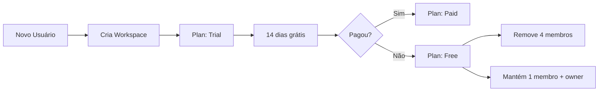

# 🎯 NOVO PASSO 3: CONVITE DE EQUIPE

## ✅ OBJETIVO ALCANÇADO
Criado novo passo no onboarding (passo 3) para convidar membros da equipe ao workspace recém-criado, com sistema completo de planos (Free, Trial, Paid) e lógica de expiry automática.

---

## 📁 ARQUIVOS CRIADOS

### **1. `team-invite-step.tsx`** (312 linhas)
Componente completo do passo 3 com:
- Design consistente com passos 1 e 2 (background crosshatch + gradiente colorido)
- Formulário de convite com email + role (Membro/Admin)
- Validação de email e duplicatas
- Sistema de limites por plano
- Warning visual quando limite é atingido
- Lista de convites adicionados com remoção individual
- Integração completa com Supabase

### **2. `SUPABASE_TEAM_INVITES_MIGRATION.sql`** (350 linhas)
Script SQL completo com:
- Tabela `workspace_invites`
- Sistema de planos no `workspaces`
- Funções para aceitar convites
- Lógica de cleanup automático de trials expirados
- RLS policies de segurança
- Cron jobs (opcional)

### **3. `TEAM_INVITE_STEP_DOCUMENTACAO.md`**
Este documento com toda a documentação.

---

## 📁 ARQUIVOS MODIFICADOS

### **1. `onboarding-container.tsx`**
- Adicionado import: `TeamInviteStep`
- Inserido no array STEPS na posição 3
- Steps reordenados: UserTypeStep agora é passo 4, etc.
- Total de passos: 9 → 10

### **2. `use-onboarding.ts`**
- `TOTAL_STEPS` atualizado: 9 → 10

---

## 🎨 DESIGN DO COMPONENTE

### **Layout Visual:**
```
┌─────────────────────────────────────────────┐
│                                             │
│          [Gradiente Colorido]               │
│             Isacar.dev                      │
│                                             │
│     ⚠️ Plano Pago necessário...            │  ← Badge (se limite atingido)
│                                             │
│   Convide colegas de equipe                 │
│   Convide colegas de equipe para...         │
│                                             │
│   Email                                     │
│   [joao@exemplo.com] [Membro ▼]            │
│   [+ Adicionar e-mail]                      │
│                                             │
│   📧 kleoveklein@gmail.com                  │
│      Membro                         [X]     │
│                                             │
│   0 de 1 convite(s)   [Trial 14 dias]      │
│                                             │
│   [        Continuar        ]               │
│                                             │
│   Eu farei isso mais tarde                  │
│                                             │
└─────────────────────────────────────────────┘
```

### **Elementos:**
- ✅ **Background**: Crosshatch + gradiente branco
- ✅ **Gradiente colorido**: Azul, roxo, rosa (igual passo 1 e 2)
- ✅ **Logo**: Isacar.dev centralizada
- ✅ **Badge de plano**: Aparece se tentar adicionar mais de 1 no grátis
- ✅ **User info panel**: Canto inferior esquerdo
- ✅ **Help button**: Canto inferior direito
- ✅ **Input email**: Com placeholder
- ✅ **Select role**: Membro ou Admin
- ✅ **Lista de convites**: Cards com avatar, email, role e botão X
- ✅ **Contador**: Mostra X de Y convites
- ✅ **Badge trial**: Indicador visual do plano
- ✅ **Botão continuar**: Full width, preto
- ✅ **Link pular**: Texto cinza sublinhado

---

## 🔧 LÓGICA DE PLANOS

### **Limites por Plano:**

| Plano | Membros Máximos | Duração Trial | Comportamento |
|-------|----------------|---------------|---------------|
| **Free** | 1 membro | - | Permanente até upgrade |
| **Trial** | 5 membros | 14 dias | Após 14 dias → Free (remove 4 membros) |
| **Paid** | 5 membros | - | Permanente enquanto pago |

### **Fluxo de Trial:**



### **Validações:**

#### **1. Ao Adicionar Convite:**
```typescript
✅ Email válido (regex)
✅ Não duplicado
✅ Dentro do limite do plano
❌ Se Free e já tem 1 → Mostrar warning
```

#### **2. Ao Aceitar Convite:**
```sql
✅ Token válido
✅ Não expirado
✅ Email corresponde
✅ Workspace dentro do limite
❌ Se limite atingido → Rejeitar
```

#### **3. Após 14 Dias (Trial):**
```sql
✅ Verificar trial_ends_at < NOW()
✅ Mudar para plan_type = 'free'
✅ Remover membros extras (manter 1 + owner)
✅ Deletar dados relacionados (opcional)
```

---

## 📊 ESTRUTURA DO BANCO DE DADOS

### **Tabela: `workspace_invites`**

| Coluna | Tipo | Descrição |
|--------|------|-----------|
| `id` | UUID | Primary key |
| `workspace_id` | UUID | FK → workspaces(id) |
| `email` | TEXT | Email do convidado |
| `role` | TEXT | 'member' ou 'admin' |
| `invited_by` | UUID | FK → auth.users(id) |
| `status` | TEXT | 'pending', 'accepted', 'rejected', 'expired' |
| `token` | TEXT | Token único de 64 caracteres |
| `expires_at` | TIMESTAMPTZ | Data de expiração (14 dias) |
| `accepted_at` | TIMESTAMPTZ | Data de aceitação |
| `created_at` | TIMESTAMPTZ | Data de criação |

### **Colunas Adicionadas em `workspaces`:**

| Coluna | Tipo | Padrão | Descrição |
|--------|------|--------|-----------|
| `plan_type` | TEXT | 'trial' | 'free', 'trial', 'paid' |
| `trial_ends_at` | TIMESTAMPTZ | NULL | Data fim do trial |
| `subscription_id` | TEXT | NULL | ID da assinatura (Stripe, etc) |
| `subscription_status` | TEXT | NULL | 'active', 'canceled', 'expired', 'trialing' |
| `max_members` | INTEGER | 1 | Limite de membros |
| `plan_updated_at` | TIMESTAMPTZ | NOW() | Última atualização do plano |

---

## 🔄 FUNÇÕES SUPABASE CRIADAS

### **1. `accept_workspace_invite(invite_token TEXT)`**
**Descrição**: Aceita um convite e adiciona o usuário ao workspace.

**Parâmetros:**
- `invite_token`: Token único do convite (64 caracteres)

**Retorna:**
```json
{
  "success": true,
  "workspace_id": "uuid",
  "role": "member"
}
```

**Validações:**
- Token válido e não expirado
- Email corresponde ao usuário logado
- Workspace não atingiu limite de membros

---

### **2. `cleanup_expired_trial_members()`**
**Descrição**: Remove membros extras de workspaces com trial expirado.

**Execução:** Automática via cron (diariamente à meia-noite)

**Ações:**
1. Busca workspaces com `plan_type = 'trial'` e `trial_ends_at < NOW()`
2. Muda para `plan_type = 'free'`
3. Remove membros extras (mantém 1 + owner)
4. Atualiza `subscription_status = 'expired'`

---

### **3. `get_workspace_plan_status(p_workspace_id UUID)`**
**Descrição**: Retorna informações do plano do workspace.

**Retorna:**
```json
{
  "plan_type": "trial",
  "subscription_status": "trialing",
  "trial_ends_at": "2024-12-01T00:00:00Z",
  "days_remaining": 7,
  "max_members": 5,
  "current_members": 2,
  "can_add_members": true
}
```

---

### **4. `expire_old_invites()`**
**Descrição**: Marca convites expirados como 'expired'.

**Execução:** Automática via cron (a cada hora)

**Ação:** `UPDATE workspace_invites SET status = 'expired' WHERE expires_at < NOW()`

---

## 🚀 COMO TESTAR

### **1. Preparar Supabase:**

```bash
# 1. Abrir Supabase Dashboard
# 2. Ir em SQL Editor
# 3. Copiar e executar: SUPABASE_TEAM_INVITES_MIGRATION.sql
# 4. Verificar tabelas criadas:
SELECT * FROM workspace_invites LIMIT 1;
```

### **2. Testar Novo Usuário:**

```bash
# Opção A: Limpar Analytics (Simular novo usuário)
DELETE FROM onboarding_analytics WHERE user_id = '[seu-user-id]';

# Opção B: Criar nova conta
# 1. Logout
# 2. Criar nova conta com email diferente
# 3. Login
```

### **3. Navegar pelo Onboarding:**

```
Passo 1: WelcomeStep → Ver logo + gradiente
Passo 2: WorkspaceStep → Criar workspace
Passo 3: TeamInviteStep → ✨ NOVO! Convidar equipe
Passo 4: UserTypeStep → Tipo de usuário
... (continua)
```

### **4. Testar Convites:**

#### **Adicionar 1 Email (Free):**
```
1. Digite email válido
2. Selecionar "Membro"
3. Clicar "+ Adicionar e-mail"
4. ✅ Email adicionado
5. Clicar "Continuar"
6. ✅ Convite salvo no Supabase
```

#### **Tentar Adicionar 2 Emails (Free):**
```
1. Adicionar primeiro email → ✅ OK
2. Tentar adicionar segundo → ⚠️ Badge de warning aparece
3. Limite: 0 de 1 convite(s)
4. Botão "+ Adicionar" desabilitado
```

#### **Com Trial (5 Membros):**
```
1. Workspace criado → plan_type = 'trial'
2. trial_ends_at = NOW() + 14 dias
3. Adicionar até 5 emails → ✅ OK
4. Badge: "Trial 14 dias"
5. Contador: "3 de 5 convite(s)"
```

### **5. Testar Expiração (Manualmente):**

```sql
-- Simular trial expirado
UPDATE workspaces
SET trial_ends_at = NOW() - INTERVAL '1 day'
WHERE id = 'seu-workspace-id';

-- Executar cleanup manual
SELECT cleanup_expired_trial_members();

-- Verificar resultado
SELECT plan_type, subscription_status FROM workspaces WHERE id = 'seu-workspace-id';
-- Deve retornar: plan_type = 'free', subscription_status = 'expired'

-- Verificar membros
SELECT COUNT(*) FROM workspace_members WHERE workspace_id = 'seu-workspace-id';
-- Deve retornar: 2 (owner + 1 membro)
```

---

## 🎭 ANIMAÇÕES IMPLEMENTADAS

### **Gradiente de Fundo:**
```typescript
<motion.div
  animate={{
    scale: [1, 1.2, 1],
    opacity: [0.3, 0.5, 0.3],
  }}
  transition={{ duration: 4, repeat: Infinity }}
  className="h-32 w-32 rounded-full bg-blue-500 blur-3xl"
/>
```

### **Badge de Warning:**
```typescript
<motion.div
  initial={{ opacity: 0, y: -10 }}
  animate={{ opacity: 1, y: 0 }}
  className="border-yellow-200 bg-yellow-50"
>
  <Crown className="h-4 w-4" />
  Plano Pago necessário...
</motion.div>
```

### **Lista de Convites (Stagger):**
```typescript
{invites.map((invite, index) => (
  <motion.div
    initial={{ opacity: 0, x: -10 }}
    animate={{ opacity: 1, x: 0 }}
    transition={{ delay: index * 0.05 }}
  />
))}
```

---

## 🔐 SEGURANÇA (RLS POLICIES)

### **1. Visualizar Convites:**
```sql
-- Usuários veem convites que enviaram
CREATE POLICY "Users can view their sent invites"
  ON workspace_invites FOR SELECT
  USING (invited_by = auth.uid());
```

### **2. Criar Convites:**
```sql
-- Apenas owners/admins podem criar convites
CREATE POLICY "Workspace owners can create invites"
  ON workspace_invites FOR INSERT
  WITH CHECK (
    EXISTS (
      SELECT 1 FROM workspace_members
      WHERE workspace_id = workspace_invites.workspace_id
        AND user_id = auth.uid()
        AND role IN ('owner', 'admin')
    )
  );
```

### **3. Atualizar Convites:**
```sql
-- Usuários podem aceitar/rejeitar seus convites
CREATE POLICY "Users can update their invites"
  ON workspace_invites FOR UPDATE
  USING (
    email = (SELECT email FROM auth.users WHERE id = auth.uid())
    OR invited_by = auth.uid()
  );
```

---

## 📈 MÉTRICAS E ANALYTICS

### **Campos no `onboarding_analytics` (futuro):**
```sql
-- Adicionar ao final da migração
ALTER TABLE onboarding_analytics
  ADD COLUMN IF NOT EXISTS invited_members INTEGER DEFAULT 0,
  ADD COLUMN IF NOT EXISTS accepted_invites INTEGER DEFAULT 0;
```

### **Tracking de Eventos:**
```typescript
// No componente
await trackAction('invite', true)

// No hook use-onboarding
const actionMap = {
  'invite': 'invited_team_member',
}
```

---

## 🎯 PRÓXIMOS PASSOS (FUTURO)

### **1. Sistema de Notificações:**
- Email automático ao receber convite
- Lembrete antes de expirar (7 dias)
- Notificação de trial expirando

### **2. Página de Aceitação:**
```
/invite/accept?token=abc123xyz
```
- Visualizar workspace
- Ver quem convidou
- Botão "Aceitar" ou "Rejeitar"

### **3. Integração com Stripe:**
- Webhook para atualizar planos
- Trial → Paid conversion
- Cancelamento de assinatura

### **4. Dashboard de Membros:**
- Listar membros do workspace
- Remover membros manualmente
- Reenviar convites
- Ver status de convites

---

## ⚠️ PONTOS DE ATENÇÃO

### **1. Cron Jobs:**
- **Requer `pg_cron`** extensão no Supabase
- Habilitar em: `Database > Extensions > pg_cron`
- Descomentar as linhas de `cron.schedule` no SQL

### **2. Limpeza de Dados:**
- **IMPORTANTE**: Ao remover membros, deletar dados relacionados?
- **Opção 1**: Deletar tarefas/documentos do membro removido
- **Opção 2**: Manter dados mas remover acesso
- **Atual**: Apenas remove da tabela `workspace_members`

### **3. Trial Simultâneos:**
- Usuário pode criar múltiplos workspaces
- Cada workspace tem seu próprio trial independente
- Considerar: 1 trial por usuário ou por workspace?

### **4. Email Duplicado:**
- Usuário pode ser convidado para múltiplos workspaces
- Verificar: `workspace_id + email` unique constraint?
- Atual: Permite convites duplicados em workspaces diferentes

---

## ✅ RESULTADO FINAL

### **Funcionalidades Implementadas:**
- ✅ Componente TeamInviteStep (passo 3)
- ✅ Design consistente (background + gradiente + logo)
- ✅ Sistema de convites com email + role
- ✅ Validação de email e duplicatas
- ✅ Limites por plano (Free: 1, Trial/Paid: 5)
- ✅ Badge de warning quando limite atingido
- ✅ Lista de convites com remoção individual
- ✅ Botão "Continuar" full width
- ✅ Link "Eu farei isso mais tarde"
- ✅ Integração com Supabase
- ✅ Tabela `workspace_invites`
- ✅ Sistema de planos em `workspaces`
- ✅ Função aceitar convite
- ✅ Lógica de cleanup automático
- ✅ RLS policies de segurança
- ✅ Total de passos atualizado: 10
- ✅ Onboarding container atualizado
- ✅ Hook use-onboarding atualizado

### **Status:**
🚀 **PRONTO PARA TESTES!**

### **Como Começar:**
```bash
1. Execute o SQL no Supabase
2. Teste criando nova conta ou limpando analytics
3. Navegue até o passo 3 do onboarding
4. Adicione convites e clique "Continuar"
5. Verifique no Supabase se os convites foram salvos
```

---

**A plataforma ISACAR agora tem um sistema completo de convites de equipe integrado ao onboarding! 🎉👥**
